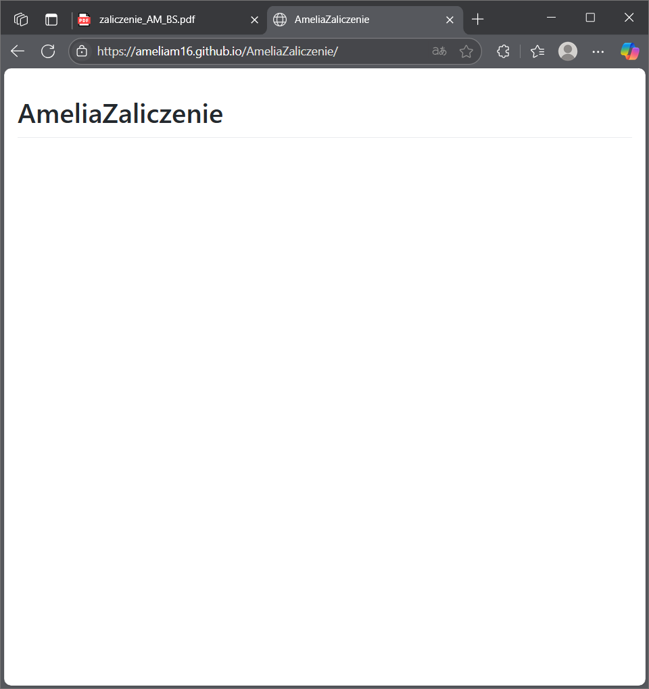

# AmeliaZaliczenie

# 🌐 AmeliaZaliczenie

[👉 Zobacz stronę na GitHub Pages](https://AmeliaM16.github.io/AmeliaZaliczenie/)



## 📑 Spis treści

- [🛠 Technologie](#-technologie)
- [🚀 Uruchomienie projektu](#-uruchomienie-projektu)
- [👥 Twórcy](#-twórcy)

---

## 🛠 Technologie

Projekt został zbudowany przy użyciu:

- HTML5
- CSS3

---

## 🚀 Uruchomienie projektu

1. Sklonuj repozytorium:
   ```bash
   git clone https://github.com/AmeliaM16/AmeliaZaliczenie.git
